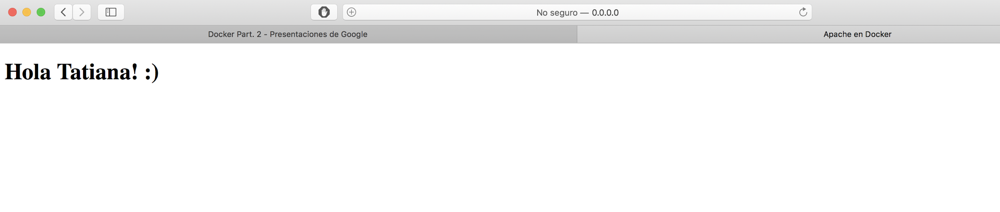
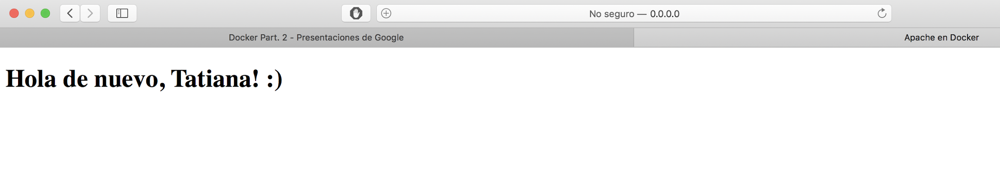
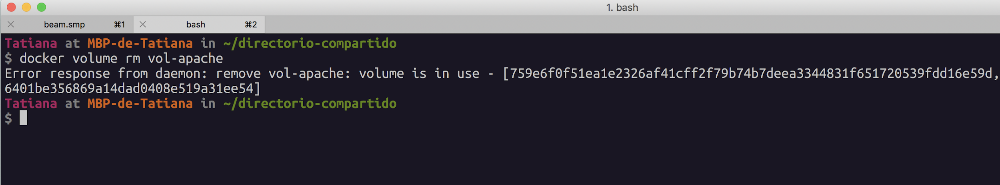

<!-- size: 16:9 -->
<!-- theme: default -->

<!-- paginate: false -->

<!-- headingDivider: 1 -->

<style>
h1 {
  text-align: center;
}
img[alt~="center"] {
  display: block;
  margin: 0 auto;
}
</style>

# DOCKER - Parte 2


---

## Recordatorio...


`docker ps` Contenedores creados en ejecución

`docker ps -a` Contenedores creados (incluye los que están parados)

`docker container ls`  (con o sin -a)

`docker run NOMBRE_IMAGEN` Crear un contenedor (si no tiene la imagen en local, la descarga)

`docker image ls` Ver las imágenes disponibles en local 


Docker da un nombre aleatorio a los contenedores si no lo elegimos nosotros. Todos los contenedores tienen un ID

```bash
$ docker ps -a
CONTAINER ID   IMAGE                    COMMAND                  CREATED         STATUS                      PORTS     NAMES
c8bb700e5f39   hello-world              "/hello"                 5 seconds ago   Exited (0) 4 seconds ago              busy_haibt
efe18fd91e7b   dodero/myserver:latest   "/bin/sh -c 'apache2…"   20 hours ago    Exited (130) 20 hours ago             myserver
```

---

`docker rm busy_haibt` Para borrar contenedores

`docker rm c8b` (no hace falta el ID completo)

Elegir el nombre del contenedor (debe ser único en local):

`docker run --name=hola hello-world`

Crear un contenedor asignando un puerto random en local:

`docker run -d -P --name=apache-server bitnami/apache`

`docker ps -a` (para ver puerto asignado)

Ejecutar terminal en el contenedor creado:

`docker exec -it apache-server /bin/bash`

---

Construir una imagen nueva

```bash
mkdir mi-apache
nano index.html
mv index.html mi-apache
nano Dockerfile
```

Dockerfile:
```docker
FROM bitnami/apache
COPY index.html /opt/bitnami/apache/htdocs/index.html
```

```bash
docker build -t usuario/mi-apache .
docker run -d -P --name=mi-apache-1 usuario/mi-apache
```

Subir nueva imagen a Docker Hub:

`docker push usuario/mi-apache`

---

## Directorios enlazados y volúmenes

Para compartir información con Docker cuando necesitamos:

- Compartir un __directorio__ entre múltiple contenedores.
- Compartir __un directorio__ entre el host y un contenedor.
- Compartir __un fichero__ entre el host y un contenedor.

Opciones:

- __Directorios enlazados__ *(bind):* la información se guarda fuera de Docker en el host local. Esta opción es mejor para datos no generados por los contenedores.
- __Volúmenes__: la información se guarda usando Docker. Mejor para datos generados por los propios contenedores.

---

## Directorios enlazados (bind)

Características:

- Permiten  __persistencia__  de la información del contenedor.
- Se montan en un  __path específico de la máquina local__  (fuera de Docker).
- Permiten  __borrar los contenedores sin perder la información__ .

---

### Ejemplo con directorios enlazados (bind) (1)

Crear directorio local para compartir:

`mkdir /Users/Usuario/directorio-compartido`

Ejecutar el contenedor:

```bash
docker run -d -P --name=apache-bind-1 \
  --mount type=bind,source=/Users/Usuario/directorio-compartido,target=/app bitnami/apache
```

---

Editar el fichero con _nano_ (u otro editor)

`nano /Users/Usuario/directorio-compartido/index.html`

```html
<!DOCTYPE html>
<html lang="es">
<head>
  <meta charset="utf-8">
  <title>Apache en Docker</title>
  <meta name="viewport" content="width=device-width, initial-scale=1.0">
</head>
<body>
  <h1>Hola Usuario! :)</h1>
</body>
</html>
```

---

Si eliminamos el contenedor, no perdemos el contenido de nuestra web :)

`docker stop apache-bind-1`

`docker rm apache-bind-1`

```bash
docker run -d -P --name=apache-bind-2 \
  --mount type=bind,source=/Users/Usuario/directorio-compartido,target=/app bitnami/apache
```



---

## Volúmenes

Características:

- Permiten persistencia de información del contenedor.
- Se montan en un path específico del contenedor.
- El acceso a la información sólo puede realizarse a través de Docker.

---

### Ejemplo con volúmenes (1)

Creando un volumen para la web

`docker run -d -P --name=apache-volume-1 --mount type=volume,source=vol-apache,target=/app bitnami/apache`

`docker ps -a (para ver puerto asignado)`

`docker volume ls`

Acceso al volumen

`docker exec -it apache-volume-1 /bin/bash`

Actualizamos el contenido del volumen

`nano index.html`

`docker cp index.html apache-volume-1:app/`

---

Acceso al contenido de la web



Compartir volumen con otro contenedor

`docker run -d -P --name=apache-volume-2 --mount type=volume,source=vol-apache,target=/app bitnami/apache`

Borrando volumen

`docker stop apache-volume-2`

`docker rm apache-volume-2`

`docker volume remove vol-apache`

---

Borrando volumen



Borrando volumen (retry)

`docker rm apache-volume-1`

`docker rm apache-volume-2`

`docker volume rm vol-apache`

`docker volume ls (borrado ok!)`

---

##  Configuraciones de red

Algunos conceptos

Permiten  __comunicación entre todos los contenedores__  pertenecientes a dicha red a través del nombre del contenedor.

Permiten  __aislamiento__  con otros contenedores.

Un contenedor puede  __pertenecer a varias__  redes.

---

##  Tipos de redes

Ver las redes existentes: `docker network ls`

- _host_  representa la red del propio equipo y haría referencia a eth0
- _bridge_  representa la red docker0 y a ella se conectan todos los contenedores por defecto. 
- _none_  significa que el contenedor no se incluye en ninguna red y si verificamos esto con el comando ifconfig dentro del contenedor veríamos que solo tiene la interfaz de loopback lo

Saber qué contenedores usan un tipo de red: `docker network inspect bridge`

---

##  Ejemplo de configuración de red (1)
https://github.com/bitnami/bitnami-docker-wordpress

Crear una nueva red

`docker network create wordpress-network`

Crear volume

`docker volume create --name mariadb_data`

Crear primer contenedor que usa la red (base de datos)

```bash
docker run -d --name mariadb --env ALLOW_EMPTY_PASSWORD=yes \
  --env MARIADB_USER=bn_wordpress \
  --env MARIADB_DATABASE=bitnami_wordpress \
  --network wordpress-network \
  --volume mariadb_data:/bitnami/mariadb bitnami/mariadb:latest
```

---

Crear segundo volumen

`docker volume create --name wordpress_data`

Crear segundo contenedor que usa la red (wordpress)

```bash
docker run -d --name wordpress -p 8080:8080 -p 8443:8443 \
  --env ALLOW_EMPTY_PASSWORD=yes \
  --env WORDPRESS_DATABASE_USER=bn_wordpress \
  --env WORDPRESS_DATABASE_NAME=bitnami_wordpress \
  --network wordpress-network \
  --volume wordpress_data:/bitnami/wordpress bitnami/wordpress:latest
```

---

## Tarea: Práctica 2

Subir un documento PDF con los comandos realizados para resolver los siguientes ejercicios propuestos. Incluir también la respuesta a las preguntas realizadas y capturas donde se requiera mostrar en el navegador el correcto funcionamiento de los contenedores.

### Parte 1

1. Crear volumen compartido “volumenDocker”
2. Crear un contenedor de Nginx que use el volumen "volumenDocker".
3. Modifique el contenido del fichero index.html incluyendo un saludo personal, en lugar del texto por defecto.
4. Cree un segundo contenedor que también use el volumen "volumenDocker".
5. Compruebe que puede acceder a localhost:80 (primer contenedor) y localhost:81 (segundo contenedor) y ver el contenido de index.html.

---

### Parte 2

1. Crear una nueva red “redDocker”.
2. Crear un contenedor de Ubuntu “Ubuntu1”.
3. Crear un contenedor de Ubuntu “Ubuntu2”.
4. Conectar “Ubuntu1” a la red “redDocker”.
5. Intentar hacer ping a “Ubuntu1” desde “Ubuntu2”. ¿Funciona?, ¿por qué?.
6. Conectar “Ubuntu2” a la red “redDocker”.
7. Intentar de nuevo hacer ping a “Ubuntu1” desde “Ubuntu2”. ¿Funciona?, ¿por qué?.

---

## Task 2

Upload a PDF document with the needed commands performed to solve the following proposed exercises. Include also the answer to the included questions and screenshots where is required see the correct functionality of the containers.

###  Part 1

1. Create shared volume "DockerVolume”
2. Create a Nginx container that uses the "DockerVolume" volume.
3. Update the content of the index.html file by including a personal greeting, instead of the default content.
4. Create a second container that uses the "DockerVolume" volume.
5. Check that you can access localhost:80 (first container) and localhost:81 (second container) and see the content of index.html.

---

### Part 2

1. Create a new "DockerNetwork" network.
2. Create an Ubuntu container "Ubuntu1".
3. Create an Ubuntu container "Ubuntu2".
4. Connect "Ubuntu1" to the "DockerNetwork" network.
5. Try to do "ping" from "Ubuntu1" to "Ubuntu2". Does it work? Why?.
6. Connect "Ubuntu2" to the "DockerNetwork" network.
7. Try to do "ping" from "Ubuntu1" to "Ubuntu2" again. Does it work? Why?.
